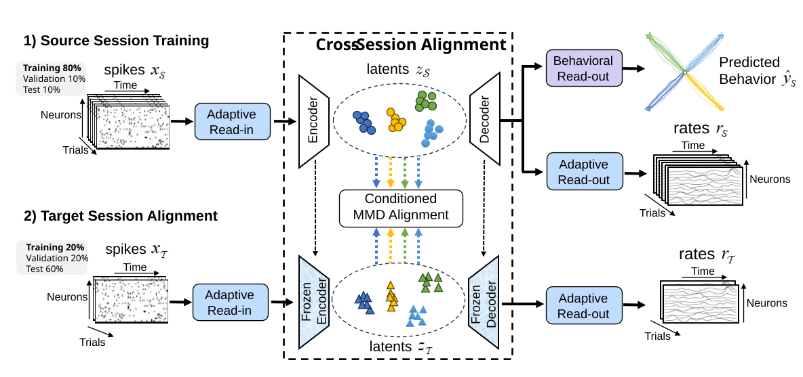

# Stable Neural Decoding Across Sessions via Task-Conditioned Latent Alignment for Brain-Machine Interfaces


## Overview
This repository contains code for Task-Conditioned Latent Alignment (TCLA). TCLA is a framework for stable neural decoding across recording sessions and subjects. The full manuscript evaluates TCLA on seven nonhuman-primate datasets. This repository
provides examples for cross-session and cross-subject adaptation using *Chewie CO 2016* and *Mihili CO 2014*.

TCLA was initially introduced in our preliminary study,
**Cross-Session Decoding of Neural Spiking Data via Task-Conditioned Latent Alignment**  
<!-- Canyang Zhao, Bolin Peng, J. Patrick Mayo, Ce Ju, and Bing Liu.  
*48th Annual International Conference of the IEEE Engineering in Medicine
and Biology Society (EMBC)*, 2026.   -->
[arXiv:2601.19963](https://arxiv.org/abs/2601.19963)


## Contents

```text
TCLA/
├── README.md                                     
├── requirements.txt                                # Python dependencies
├── config/                                         # Example hyperparameter files
│   ├── behavioral_decoders.yaml                    # Ridge and LSTM decoder hyperparameters
│   ├── chewie_co_2016_cross_session.yaml           # Chewie session_0 -> session_1 experiment config
│   └── chewie_to_mihili_cross_subject.yaml         # Chewie session_0 -> Mihili session_0 experiment config
├── data/                                           # Small example datasets
│   ├── Chewie_CO_2016/
│   │   ├── session_0.pickle                        # Source session example
│   │   ├── session_1.pickle                        # Target session example
│   │   └── adan_channel_ids.json                   # ADAN channel mapping metadata
│   └── Mihili_CO_2014/
│       └── session_0.pickle                        # Cross-subject target session example
├── TCLA/                                         
│   ├── data/
│   │   └── data_load.py                            # Session pickle loader
│   ├── networks/
│   │   ├── blocks.py                               # Modules
│   │   ├── count_wrapper.py                        # AE output wrapper
│   │   └── s4.py                                   # S4 sequence blocks
│   └── losses.py                                   # Training losses
└── examples/                                     
    ├── Chewie_CO_2016/
    │   ├── AE_model/train.py                       # Stage1 source training
    │   ├── Stage2_MMD/with_align_all_labels.py     # Cross-session target alignment
    │   └── to_Mihili_CO_2014/
    │       └── Stage2_MMD/with_align_all_labels.py # Cross-subject target alignment
    └── behavioral_decoder/
        ├── ridge_decoder.py                        # Ridge decoder on Stage2 latents
        └── lstm_decoder.py                         # LSTM decoder on Stage2 latents
```

## Dependencies

To get start, we recommend creating a conda environment first.

```bash
git clone git@github.com:FAMD-CASIA/TCLA.git
cd TCLA
conda create --name TCLA python=3.9
conda activate TCLA
pip install -r requirements.txt
```

## Downloading Monkey Data

`data/` stores example data for quick validation. The complete datasets used in the paper can be obtained from the following URLs:

Chewie\_CO\_2016, Mihili\_CO\_2014, Jango\_ISO\_2015, and Spike\_ISO\_2012 are available from https://datadryad.org/dataset/doi:10.5061/dryad.cvdncjt7n. 

L\_paralle\_CO and V\_paralle\_CO were are available from https://datadryad.org/dataset/doi:10.5061/dryad.jsxksn0qd. 

## Data Format
Save your data as .pickle format and should contain three keys:

```python
{
    "spike": spike_array,
    "behavior": behavior_array,
    "label": label_array,
}
```

Expected array shapes:

- `spike`: `num_trials x num_time_bins x num_neurons`
- `behavior`: `num_trials x num_time_bins x 2`
- `label`: `num_trials`


## Running the experiments

Stage1 source training:

```bash
python examples/Chewie_CO_2016/AE_model/train.py
```

Cross-session Stage2 target alignment, after Stage1 has produced the source checkpoint:

```bash
python examples/Chewie_CO_2016/Stage2_MMD/with_align_all_labels.py
```

Cross-subject Stage2 target alignment, after Stage1 has produced the source checkpoint:

```bash
python examples/Chewie_CO_2016/to_Mihili_CO_2014/Stage2_MMD/with_align_all_labels.py
```

Outputs are written under `outputs/`.
